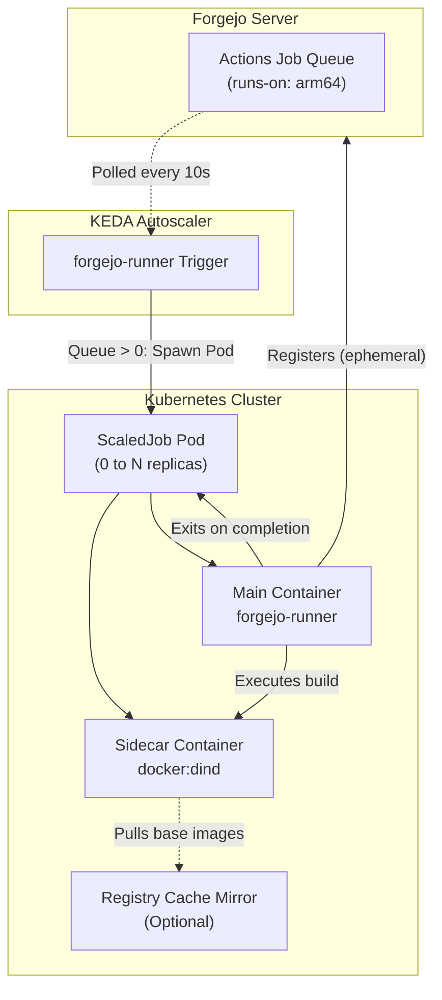

# Forgejo Runner on Kubernetes (with KEDA Autoscaling)

Most CI setups on Kubernetes suffer from one of two headaches: either you leave heavy Docker-in-Docker pods running 24/7 chewing up idle RAM, or rolling restarts leave a graveyard of orphaned "offline" runners in Forgejo's admin panel.

This Helm chart solves both. It provides ephemeral Forgejo Actions runners that **scale to zero when idle** using KEDA, spin up on demand with a native Docker-in-Docker sidecar, run your workflow, and cleanly unregister the second the job completes.



---

## Why this chart?

- **Scale to Zero**: If nobody pushed code, **0 runner pods exist**. No idle CPU, no memory wasted on worker nodes.
- **No Zombie Runners**: Runners register dynamically using `--ephemeral`. The moment a job finishes, Forgejo deletes the runner registration from its database and Kubernetes cleans up the Job pod.
- **Native K8s 1.28+ Sidecar Lifecycle**: Docker-in-Docker runs as a native sidecar (`restartPolicy: Always`). Kubernetes ensures the Docker socket is ready before the runner container starts, and automatically kills DinD when the runner exits.
- **Multi-Arch & Homelab Friendly**: Ideal for ARM64 nodes (Raspberry Pi, Turing Pi, Orange Pi, Apple Silicon) alongside x86 machines. You can run native `linux/arm64` builds without slow QEMU emulation.
- **Local Registry Cache**: Configurable `--registry-mirror` support so worker containers pull base images from an in-cluster pull-through cache, saving bandwidth and SD/SSD wear.
- **Spread Across Nodes**: Pod anti-affinity prevents all concurrent runners from piling onto a single node.

---

## Prerequisites

1. **Kubernetes 1.28+** (with privileged container support for DinD).
2. **KEDA v2.18+** installed in your cluster (`helm repo add kedacore https://kedacore.github.io/charts`).
3. A Forgejo instance (v15.0+) with Actions enabled.
4. A runner registration token or API token from your Forgejo instance:
   - Web UI: **Site Administration > Actions > Runners > Create new Runner**
   - Or API: `GET /api/v1/admin/actions/runners/registration-token`

---

## Quickstart

### 1. Add your Registration Secret

#### Option A: Plain Kubernetes Secret
```bash
kubectl create namespace forgejo-runner
kubectl create secret generic forgejo-runner-secret \
  -n forgejo-runner \
  --from-literal=token="YOUR_FORGEJO_REGISTRATION_TOKEN"
```

#### Option B: External Secrets Operator (Vault, Bitwarden, AWS Secrets Manager)
Set `secrets.externalSecrets.enabled: true` in your values and specify your `secretStoreRef` and `remoteKey`.

### 2. Install the Chart

```bash
helm upgrade --install forgejo-runner ./ \
  --namespace forgejo-runner \
  --create-namespace \
  --set forgejo.url="https://forgejo.example.com" \
  -f values.yaml
```

---

## Scaling Modes: `ScaledJob` vs `ScaledObject`

You can switch between two scaling modes via `autoscaling.mode`:

1. **`ScaledJob` (Default & Recommended)**:
   KEDA spawns an isolated, single-use Kubernetes `Job` for every waiting task in Forgejo.
   - Complete isolation between builds.
   - Clean ephemeral registration and immediate deregistration.
   - Automatic pod cleanup (`ttlSecondsAfterFinished: 60`).

2. **`ScaledObject`**:
   KEDA scales a traditional Kubernetes `Deployment` from 0 to N replicas based on queue depth.
   - Pods stay alive during `cooldownPeriod` (default: 300s) to handle rapid bursts of commits without cold booting.

---

## Workflow Example: Native ARM64 & Multi-Arch

In your repository `.forgejo/workflows/docker.yml`, target the runner using labels:

```yaml
name: Build & Push
on: [push]

jobs:
  build:
    strategy:
      matrix:
        include:
          - arch: amd64
            runs-on: docker # Runs on your existing x86 runner
          - arch: arm64
            runs-on: arm64  # Autoscales onto your K8s ARM64 nodes!
    steps:
      - uses: actions/checkout@v4
      - uses: docker/setup-buildx-action@v3
      - name: Build native slice
        run: |
          docker build --platform linux/${{ matrix.arch }} -t myapp:${{ matrix.arch }} .
```

---

## Configuration Reference

| Parameter | Description | Default |
| :--- | :--- | :--- |
| `forgejo.url` | Forgejo instance base URL | `https://forgejo.example.com` |
| `forgejo.scope` | Scope of runner (`global`, `owner`, `org`, `repo`) | `global` |
| `runner.image.repository` | Forgejo runner image | `code.forgejo.org/forgejo/runner` |
| `runner.image.tag` | Image tag | `12` |
| `runner.namePrefix` | Runner name prefix registered in Forgejo | `k8s-runner` |
| `runner.labels` | Runner labels registered in Forgejo | `["arm64:...", "linux-arm64:..."]` |
| `runner.capacity` | Max concurrent jobs per runner pod | `1` |
| `dind.image.tag` | Docker-in-Docker image tag | `28-dind` |
| `dind.privileged` | Enable privileged mode for DinD | `true` |
| `dind.registryMirror` | Optional pull-through registry cache mirror | `""` |
| `autoscaling.mode` | Scaling mode (`ScaledJob` or `ScaledObject`) | `ScaledJob` |
| `autoscaling.minReplicas` | Minimum replica count | `0` |
| `autoscaling.maxReplicas` | Maximum concurrent runners | `4` |
| `autoscaling.pollingInterval` | Seconds between queue checks | `10` |
| `autoscaling.triggerLabels` | Labels KEDA monitors for queue depth | `arm64` |
| `nodeSelector` | Node architecture selector | `kubernetes.io/arch: arm64` |
